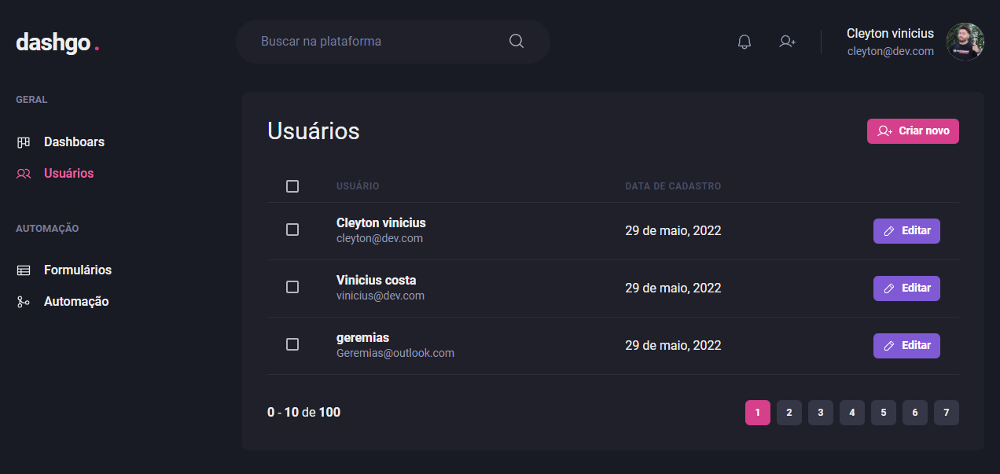

<h1 align="center"> 
     
    
     
     
</h1>

   

 
 

## ✨ Tecnologias

- [NextJS](https://nextjs.org/)
- [Typescript](https://www.typescriptlang.org)
- [Chakra UI](https://chakra-ui.com/)
- [React hook form](https://react-hook-form.com/)
- [Yup](https://github.com/jquense/yup)
